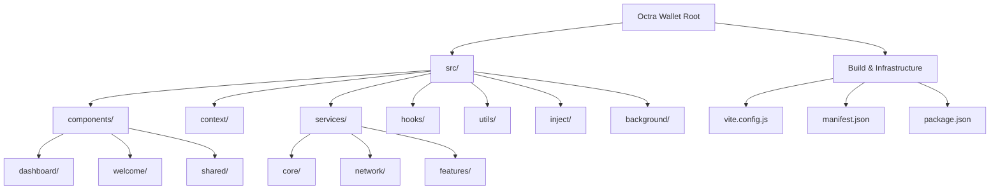

# Octra Wallet Codebase Documentation

## 1. High-Level Project Architecture

This document provides a detailed analysis of the Octra Wallet codebase, specifically the `src` directory. It covers file functions, initialization, import/export relations, and potential logic issues.

---

## 2. Source Root Directory (`src/`)

Analyzing files directly under `src/`:

### [main.tsx](file:///home/uba/codingan/octra/wallet/src/main.tsx)
- **Function**: The main entry point of the application.
- **Initialization**:
  - Loads polyfills from `./utils/polyfills.js` (CRITICAL: must be first).
  - Imports global styles (`index.css`) and modular component styles.
  - Polyfills `Buffer` and `global` for browser compatibility (required by crypto libraries).
  - Mounts the `App` component within `StrictMode` and an `ErrorBoundary`.
- **Imports**:
  - `React`, `ReactDOM`
  - `./index.css`
  - `./styles/animations.css`, `./styles/Tabs.css`, `./styles/Buttons.css`, `./styles/Forms.css`, `./styles/Modals.css`
  - `./App`
  - `./components/shared/ErrorBoundary`
  - `buffer`
- **Exports**: None.

### [App.tsx](file:///home/uba/codingan/octra/wallet/src/App.tsx)
- **Function**: The root React component that manages the top-level application state and routing.
- **Initialization**:
  - Wraps content in `SessionProvider` and `WalletProvider`.
  - Parses URL hash for dApp requests (`#/dapp/approve`).
  - Initializes the application via `walletContext.initializeApp`.
- **Logic**:
  - Uses `useWalletAuth` and `useWalletOnboarding` hooks to manage complex wallet operations.
  - Renders different screens based on `walletContext.currentView`: `loading`, `welcome`, `create_wallet`, `import_wallet`, `setup_password`, `lock`, `dashboard`, `settings`.
  - Handles global Toast notifications and Dapp approval requests.
- **Imports**:
  - React hooks (`useState`, `useCallback`, `useEffect`)
  - `./App.css`
  - Various components from `./components/...`
  - Providers from `./context/...`
  - `getRpcClient` from `./services/network/RpcService`
  - Custom hooks from `./hooks/...`
- **Exports**: Default export `App`.

### [App.css](file:///home/uba/codingan/octra/wallet/src/App.css)
- **Function**: Contains global reset and scrollbar styles.
- **Details**: Hides scrollbars for Webkit and Firefox, removes tap highlights on mobile.

### [index.css](file:///home/uba/codingan/octra/wallet/src/index.css)
- **Function**: Design System Manifest.
- **Details**: Imports Google Fonts (Inter) and modular CSS files from `./styles/`.

### [vite-env.d.ts](file:///home/uba/codingan/octra/wallet/src/vite-env.d.ts)
- **Function**: TypeScript declarations for Vite's client-side types.

## 2. Background Scripts (`src/background/`)

This directory contains the background scripts for the Chrome extension, which run in a service worker context.

### [background.js](file:///home/uba/codingan/octra/wallet/src/background/background.js)
- **Function**: The main service worker for the Octra Wallet extension. It manages dApp connections, handles transaction/message signing approvals, and performs periodic background tasks.
- **Initialization**:
  - Sets up a `bgBalanceSync` alarm to run every 3 minutes.
  - Automatically attempts to restore an encrypted session from `chrome.storage.session` on startup (`initSession`).
  - Initializes dApp connections from `chrome.storage.local`.
- **Core Logic**:
  - **Message Listener**: Central hub for `DAPP_REQUEST`, `SYNC_SESSION`, `POPUP_REQUEST`, `GET_PENDING_APPROVALS`, `RESOLVE_APPROVAL`, `GET_FEE_ESTIMATE`, and `RESET_EVERYTHING`.
  - **dApp Protocol**: Implements methods for dApps to interact with the wallet:
    - `connect`: Opens an approval popup for the user to authorize a dApp connection.
    - `disconnect`: Removes a dApp connection.
    - `signMessage` (OSM-1): Requests user approval to sign a message.
    - `signTransaction` (OTX-1): Requests user approval to sign a transaction without broadcasting.
    - `sendTransaction`: Requests user approval to sign and broadcast a transaction.
    - `contractCall`: Requests user approval to call a smart contract method (state-modifying).
    - `contractView`: Calls a smart contract view method (read-only).
    - `getPendingTransactions`: Fetches pending transactions from the network.
    - `getBalance` / `getEncryptedBalance`: Fetches balance information from the network or local cache.
  - **Approval Workflow**: Uses `requestApproval` to open a popup window for user confirmation.
  - **Session Security**: Uses a "Zero-Trust" memory-only session key (`memorySessionKey`) to decrypt the private key stored in session storage.
  - **Transaction Helpers**: `signTransactionOnly` and `signAndBroadcastTransaction` utilize shared crypto utilities to perform the actual signing and network broadcasting.
- **Imports**:
  - `tweetnacl`: (Imported but appears UNUSED in this file).
  - `../services/network/RpcService`: For network interactions.
  - `../services/features/BackgroundSyncService`: For periodic data syncing.
  - `../utils/crypto`: For encryption/decryption.
  - `../services/core/SessionService`: Core session management.
  - Dynamic imports: `../utils/osm1`, `../utils/crypto/transaction`.
- **Potential Issues**:
  - None identified (Previous unused `tweetnacl` import has been removed).

---

## 3. Components (`src/components/`)

### 3.1 dApp Components (`src/components/dapp/`)
Components related to dApp interaction and permission requests.

#### [DappApproval.tsx](file:///home/uba/codingan/octra/wallet/src/components/dapp/DappApproval.tsx)
- **Function**: A dedicated screen/modal displayed when a dApp requests an action (Connect, Sign Message, Sign/Send Transaction).
- **Logic**:
  - Dynamically renders content based on the `request.action` type.
  - Implements `handleApprove` and `handleReject` callbacks to communicate user decisions back to the background script or parent component.
  - Uses `ConfirmModal` to prevent accidental rejections.
- **Imports**:
  - `QiubitLogo`, `CheckCircleIcon`, etc., from `../shared/Icons`.
  - `ConfirmModal` from `../shared`.
- **Exports**: Default export `DappApproval`.

---

### 3.2 Dashboard Components (`src/components/dashboard/`)
The main interface after the wallet is unlocked.

#### [Dashboard.tsx](file:///home/uba/codingan/octra/wallet/src/components/dashboard/Dashboard.tsx)
- **Function**: The central orchestrator for the dashboard. It manages the sub-views and global modals for wallet management.
- **Logic**:
  - Uses `useWallet` hook for global state (wallets, active wallet, balances, transactions).
  - Handles view switching between `Home`, `Send`, `Swap`, `History`, `Privacy`, `NFT`, and `TokenDetail`.
  - Orchestrates wallet-level operations like renaming, creating, importing, and deleting wallets.
  - Implements state for balance visibility toggle and toast notifications.
- **Imports**:
  - Providers: `useWallet`, `useSession`.
  - Layout: `DashboardHeader`, `BottomNavigation`.
  - Modals: `WalletManagementModals`, `AccountQRModal`, `AddWalletModal`.
  - Views: `HomeView`, `SendView`, `SwapView`, `HistoryView`, `PrivacyView`, `TokenDetailView`, `NFTGallery`.
- **Exports**: Named export `Dashboard`.

#### 3.2.1 Dashboard Layout & Global Modals
- **[DashboardHeader.tsx](file:///home/uba/codingan/octra/wallet/src/components/dashboard/layout/Header/DashboardHeader.tsx)**: Top bar with wallet switcher (using `WalletSelector`), refresh button, and shortcuts to settings/QR.
- **[BottomNavigation.tsx](file:///home/uba/codingan/octra/wallet/src/components/dashboard/layout/Navigation/BottomNavigation.tsx)**: Persistent bottom bar for navigating between main dashboard sections.
- **[WalletManagementModals.tsx](file:///home/uba/codingan/octra/wallet/src/components/dashboard/modals/WalletManagement/WalletManagementModals.tsx)**: UI for renaming and deleting wallets, including a confirmation flow and warnings.
- **[AccountQRModal.tsx](file:///home/uba/codingan/octra/wallet/src/components/dashboard/modals/AccountQR/AccountQRModal.tsx)**: Displays the current wallet's QR code for receiving funds. Uses `qrcode.react`.

#### [HomeView.tsx](file:///home/uba/codingan/octra/wallet/src/components/dashboard/Home/HomeView.tsx)
- **Function**: The default view of the dashboard, showing the user's balance, address, and list of crypto/NFT assets.
- **Logic**:
  - **Price Management**: Fetches and periodically updates the OCT price in USD using `PriceService`.
  - **Balance Display**: Shows the public balance in both OCT and USD. Supports hiding the balance for privacy.
  - **Asset List**: Aggregates the native OCT token and any tracked OCS01/custom tokens into a unified list.
  - **Interactions**: Handlers for copying the wallet address, switching to Send/History/NFT views, and opening the `AddCustomTokenModal`.
- **Imports**:
  - `PriceService`: For USD conversions.
  - `AddCustomTokenModal`: For adding new tokens.
  - `TokenItem`: For rendering individual asset rows.
- **Exports**: Named export `HomeView`.

#### [SendView.tsx](file:///home/uba/codingan/octra/wallet/src/components/dashboard/Send/SendView.tsx)
- **Function**: A comprehensive, multi-step interface for sending Native OCT or OCS01 tokens.
- **Workflow**:
  1. **Select Token**: Choose between available assets.
  2. **Form**: Enter recipient address and amount. Includes fee estimation and low balance warnings.
  3. **Confirmation**: A `ConfirmTransactionModal` for final review and fee speed selection.
  4. **Signing/Sending**: Handles transaction signing via `KeyringService` and broadcasting via `RpcService`.
  5. **Status Waiting**: Displays a premium "Sending Payment" animation with a 45s timeout and mempool verification logic for robust recovery.
  6. **Result**: Shows success (with tx hash and OctraScan link) or error states.
- **Logic**:
  - **Robustness**: Implements transaction polling to confirm on-chain status after broadcasting.
  - **History**: Automatically adds successful transactions to the local secure history.
  - **Security**: Verifies the wallet is unlocked before signing; redirects to lock screen if necessary.
- **Imports**:
  - `KeyringService`, `WalletService`, `RpcService`, `OCS01TokenService`.
  - `TokenSelectView`, `ConfirmTransactionModal`, `TokenIcon`.
- **Exports**: Named export `SendView`.
- **Observations**: Contains a `@ts-ignore` for complex validation logic.

---

#### [SwapView.tsx](file:///home/uba/codingan/octra/wallet/src/components/dashboard/Swap/SwapView.tsx)
- **Function**: UI for swapping assets, featuring a dual-mode toggle (Public/Private).
- **Logic**:
  - **Stale-While-Revalidate**: Immediately displays cached encrypted balances while fetching fresh data from the `PrivacyService` in the background.
  - **Dynamic Balances**: Adjusts displayed token balances based on whether the user is in 'Public' or 'Private' mode.
  - **Theming**: Uses `icon.json` for token icon mapping and applies different button styles for private swaps.
- **Imports**: `PrivacyService`, `icon.json`.
- **Exports**: Named export `SwapView`.

#### [HistoryView.tsx](file:///home/uba/codingan/octra/wallet/src/components/dashboard/History/HistoryView.tsx)
- **Function**: A filtered list of all user transactions (sent, received, pending).
- **Logic**:
  - **Infinite Scrolling**: Implements an intersection-observer-style scroll listener to trigger `onLoadMore` via the `WalletContext`.
  - **Filtering**: Allows users to filter by transaction type. Successfully handles pending transactions as a separate tab.
  - **Detail View**: Integrates `TransactionDetailModal` for deep-diving into individual transaction hashes and details.
- **Imports**: `TransactionItem`, `TransactionDetailModal`.
- **Exports**: Named export `HistoryView`.

#### [PrivacyView.tsx](file:///home/uba/codingan/octra/wallet/src/components/dashboard/Privacy/PrivacyView.tsx)
- **Function**: The entry point for all privacy-centric operations (Privacy Hub).
- **Architecture**: Acts as a sub-router for several complex sub-views:
  - `PrivacyDashboard`: Overview of shielded funds and status.
  - `ShieldView`: Converting public funds to private.
  - `UnshieldView`: Converting private funds back to public.
  - `TransferView`: Sending funds privately to another address.
  - `ClaimView`: Withdrawing funds from a received private transfer.
- **Logic**:
  - **Data Aggregation**: Unified fetching of encrypted balances, pending claims, and OCS01 balances.
  - **State Management**: Orchestrates the multi-step forms and submission logic for all privacy transactions.
  - **Security Integration**: Automatically ensures the `PrivacyService` has the decrypted private key from the `KeyringService` before performing operations.
- **Imports**:
  - `PrivacyService`, `KeyringService`, `OCS01TokenService`, `PriceService`.
  - Sub-views from `./Dashboard`, `./Shield`, `./Unshield`, `./Transfer`, `./Claim`.
- **Exports**: Named export `PrivacyView`.

---

#### [NFTGallery.tsx](file:///home/uba/codingan/octra/wallet/src/components/dashboard/NFT/NFTGallery.tsx)
- **Function**: A visual gallery for managing and viewing the user's NFT collection.
- **Logic**:
  - **Fetching**: Uses a dedicated `nftService` to query the RPC for token balances and metadata.
  - **Sub-Views**: Switches between a grid view and a detail view (`NFTDetail`) within the same component.
  - **Metadata Parsing**: Handles dynamic trait/attribute rendering for various NFT standards.
- **Imports**: `nftService`, `RpcService`.
- **Exports**: Default export `NFTGallery`.
- **Observations**: The transfer functionality is currently a placeholder.

#### [TokenDetailView.tsx](file:///home/uba/codingan/octra/wallet/src/components/dashboard/TokenDetail/TokenDetailView.tsx)
- **Function**: A focused view for a specific asset (e.g., OCT, OCS-01 tokens).
- **Logic**:
  - **Transaction Filtering**: Filters the global transaction history to show only those relevant to the selected token.
  - **Quick Actions**: Provides Send, Receive (QR), and Swap (currently disabled) shortcuts.
- **Imports**: `TokenIcon`, `TransactionDetailModal`.
- **Exports**: Named export `TokenDetailView`.

#### [Transaction Components](file:///home/uba/codingan/octra/wallet/src/components/dashboard/Transactions/)
- **[TransactionItem.tsx](file:///home/uba/codingan/octra/wallet/src/components/dashboard/Transactions/TransactionItem/TransactionItem.tsx)**: A highly reusable list item that adapts its icon, color, and labels (Sent, Received, Shielded, etc.) based on the transaction type and status.
- **[TransactionDetailModal.tsx](file:///home/uba/codingan/octra/wallet/src/components/dashboard/Transactions/TransactionDetailModal/TransactionDetailModal.tsx)**: A comprehensive modal providing full transaction forensics: hash, fee, epoch, timestamps, and explorer links (`octrascan`).
- **[OCS01/](file:///home/uba/codingan/octra/wallet/src/components/dashboard/OCS01/)**: Specific UI modules for OCS-01 token interactions, managing contract-level balances and metadata displays.
- **[TokenSelect/](file:///home/uba/codingan/octra/wallet/src/components/dashboard/TokenSelect/)**: A centralized asset picker component with search and filter capabilities used in Send/Swap flows.
- **[AddWalletModal/](file:///home/uba/codingan/octra/wallet/src/components/dashboard/AddWalletModal/)**: A unified modal for adding new accounts, importing private keys, or restoring from mnemonics while the user is logged in.
- **[modals/](file:///home/uba/codingan/octra/wallet/src/components/dashboard/modals/)**: Generic dashboard modal containers (QR, Rename/Delete).

---

#### [TokenItem.tsx](file:///home/uba/codingan/octra/wallet/src/components/dashboard/TokenItem/TokenItem.tsx)
- **Function**: A reusable row component for displaying a token's symbol, balance, and fiat value.
- **Logic**:
  - **Privacy**: Respects the `hideBalance` prop to obscure sensitive financial data.
  - **Visuals**: Uses `TokenIcon` for consistent asset representation.
- **Imports**: `TokenIcon`, `crypto` utils.
- **Exports**: Named export `TokenItem`.

#### [AddCustomTokenModal.tsx](file:///home/uba/codingan/octra/wallet/src/components/dashboard/Home/AddCustomTokenModal.tsx)
- **Function**: A form-based modal for manually tracking new OCS-01 tokens.
- **Logic**:
  - **Validation**: Enforces contract address validity and required fields.
  - **Persistence**: Interfaces with `ocs01Manager` to save the custom token to local storage.
- **Imports**: `ocs01Manager`, `validation` utils.
- **Exports**: Named export `AddCustomTokenModal`.

---

### 3.3 Shared Components (`src/components/shared/`)

#### [ConfirmTransactionModal.tsx](file:///home/uba/codingan/octra/wallet/src/components/shared/ConfirmTransactionModal/ConfirmTransactionModal.tsx)
- **Function**: The final checkpoint before signing a transaction.
- **Logic**:
  - **Dynamic Totals**: Real-time calculation of `amount + fee`.
  - **Fee Switching**: Interactive popup for selecting between low/medium/high priority fee estimates.
- **Imports**: `Icons`, `crypto` utils.
- **Exports**: Named export `ConfirmTransactionModal`.

#### [Wallet Management](file:///home/uba/codingan/octra/wallet/src/components/shared/WalletSelector/WalletSelector.tsx)
- **[WalletSelector.tsx](file:///home/uba/codingan/octra/wallet/src/components/shared/WalletSelector/WalletSelector.tsx)**: The primary account switcher and manager.
- **[TokenIcon.tsx](file:///home/uba/codingan/octra/wallet/src/components/shared/TokenIcon/TokenIcon.tsx)**: A dynamic SVG/Image renderer for asset logos with automated fallbacks.
- **[LoadingScreen/](file:///home/uba/codingan/octra/wallet/src/components/shared/LoadingScreen/)**: Global application loading state with splash animations.
- **[Toast/](file:///home/uba/codingan/octra/wallet/src/components/shared/Toast/)**: A singleton notification system for providing system feedback (success/error).
- **[ErrorBoundary/](file:///home/uba/codingan/octra/wallet/src/components/shared/ErrorBoundary/)**: Top-level safety wrapper that prevents app-wide crashes during component failures.
- **[ConfirmModal.tsx](file:///home/uba/codingan/octra/wallet/src/components/shared/ConfirmModal/ConfirmModal.tsx)**: A generic confirmation dialog for destructive or high-risk actions.
- **Exports**: Named exports via `index.ts`.

---

#### 3.3.4 Welcome & Onboarding (`src/components/welcome/`)
- **[WelcomeScreen.tsx](file:///home/uba/codingan/octra/wallet/src/components/welcome/WelcomeScreen.tsx)**: The multi-step onboarding journey (Mnemonic generation, verification, and password setup).
- **[SuccessSplash.css](file:///home/uba/codingan/octra/wallet/src/components/welcome/SuccessSplash.css)**: High-impact animations for successful wallet creation.

#### 3.3.5 Auth & Security (`src/components/lockscreen/` & `src/components/settings/Security/`)
- **[LockScreen.tsx](file:///home/uba/codingan/octra/wallet/src/components/lockscreen/LockScreen.tsx)**: The main gatekeeper. Handles session restoration and password validation.
- **[Security/ChangePassword/](file:///home/uba/codingan/octra/wallet/src/components/settings/Security/ChangePassword/)**: UI for rotating the master vault password.
- **[Security/ExportPrivateKey/](file:///home/uba/codingan/octra/wallet/src/components/settings/Security/ExportPrivateKey/)**: Secure interface for viewing/copying the active account's secret key.
- **[Security/RecoveryPhrase/](file:///home/uba/codingan/octra/wallet/src/components/settings/Security/RecoveryPhrase/)**: Logic for revealing the 12-word mnemonic seed after secondary authentication.

#### 3.3.6 App Settings & Controls (`src/components/settings/`)
- **[Settings.tsx](file:///home/uba/codingan/octra/wallet/src/components/settings/Settings.tsx)**: The primary router for wallet configuration.
- **[NetworkSwitcher/](file:///home/uba/codingan/octra/wallet/src/components/settings/NetworkSwitcher/)**: UI for toggling between Mainnet and Testnet, including custom RPC endpoint support.

---

### 3.4 Business Logic & API Layer (`src/services/`)

#### 3.4.1 Core Services (`src/services/core/`)

- **[KeyringService.ts](file:///home/uba/codingan/octra/wallet/src/services/core/KeyringService.ts)**: The high-security "Vault".
  - **Security**: Implements a triple-pass secure memory wipe (`secureWipeAggressive`) using `crypto.getRandomValues`. Keys are stored in private module-scope variables and NEVER exported.
  - **Operations**: Centralizes all cryptographic signing (transactions, messages, OCS-01 calls).
  - **Panic Button**: `panicLock()` for immediate memory sanitization and V8 garbage collection hint.
  - **Imports**: `tweetnacl`.

- **[WalletService.ts](file:///home/uba/codingan/octra/wallet/src/services/core/WalletService.ts)**: The Data Orchestrator.
  - **Efficiency**: Leverages `balanceCache` with request deduplication to minimize RPC traffic.
  - **Aggregation**: `refreshAllState` provides a single entry point for fetching native funds, OCS-01 tokens, and private balances.
  - **Imports**: `RpcService`, `OCS01TokenService`, `PrivacyService`.

- **[SessionService.ts](file:///home/uba/codingan/octra/wallet/src/services/core/SessionService.ts)**: The Session Manager.
  - **Logic**: Manages the 5-minute auto-lock lifecycle and session encryption/decryption using ephemeral keys.
  - **Sync**: Responsible for broadcasting session state to the Chrome background service worker.
  - **Persistence**: Securely stores encrypted passwords in local storage to support auto-unlock after browser restarts.

#### 3.4.2 Feature & Network Services

- **[PrivacyService.ts](file:///home/uba/codingan/octra/wallet/src/services/features/PrivacyService.ts)**: The FHE-Privacy Engine.
  - **Logic**: Handles encrypted balance fetching with JSON-RPC authentication. Gracefully falls back to cached/default data when RPC unavailable.
  - **Authentication**: Uses address-based signing for RPC requests (fixed key lookup issues).
  - **Key Derivation**: Expands 32-byte seeds into 64-byte secret keys required by Mainnet nodes.
  - **Caching**: Uses a dual-layer strategy: a 3-minute in-memory TTL and a persistent encrypted v2 storage cache.
  - **Imports**: `KeyringService`, `RpcService`, `nacl`.

- **[OCS01TokenService.ts](file:///home/uba/codingan/octra/wallet/src/services/features/OCS01TokenService.ts)**: Token Asset Manager.
  - **Standards**: Implements the OCS-01 protocol (ERC-20 equivalent). Contract calls disabled pending JSON-RPC implementation.
  - **Optimization**: Fetches balances in parallel batches (concurrency: 3) to prevent RPC throttling while maintaining UI responsiveness.
  - **Persistence**: Manages user-added custom contracts with secure migration paths from legacy unencrypted storage.

- **[PriceService.ts](file:///home/uba/codingan/octra/wallet/src/services/network/PriceService.ts)**: Market Data Provider.
  - **External API**: Interfaces with CoinGecko with automated cache expiration (5 mins) and fallback mock data.
  - **Formatting**: Provides high-accuracy USD value calculators and color-coded change formatters.

- **[RpcService.ts](file:///home/uba/codingan/octra/wallet/src/services/network/RpcService.ts)**: The Connectivity Layer.
  - **Extension-First**: Optimized for Chrome Extensions (CORS-bypass modes).
  - **Fault Tolerance**: Robust retry logic with exponential backoff and jitter for transient network failures.

---

### 3.5 State Management & UI Hooks (`src/context/` & `src/hooks/`)

#### 3.5.1 Context Providers
- **[SessionContext.tsx](file:///home/uba/codingan/octra/wallet/src/context/SessionContext.tsx)**: Manages the authentication lifecycle (locked/unlocked) and session key availability.
- **[WalletContext.tsx](file:///home/uba/codingan/octra/wallet/src/context/WalletContext.tsx)**: The Application's "Heart". Aggregates state from multiple specialized hooks (`useWalletState`, `useWalletData`, `useTransactionHistory`) into a single unified API for all UI components.

#### 3.5.2 Core State Hooks
- **[useWalletState.ts](file:///home/uba/codingan/octra/wallet/src/hooks/useWalletState.ts)**:
  - **Account Control**: Manages the `wallets` array and handles account switching, renaming, and deletion.
  - **Synchronization**: Ensures the `KeyringService` is always aligned with the active wallet.
- **[useAppInitialization.ts](file:///home/uba/codingan/octra/wallet/src/hooks/useAppInitialization.ts)**:
  - **Bootstrapper**: Orchestrates the initial load sequence and determines the root view (`welcome`, `lock`, or `dashboard`).
  - **RPC Provisioning**: Configures the `RpcService` based on user settings during startup.
- **[useWalletAuth.ts](file:///home/uba/codingan/octra/wallet/src/hooks/useWalletAuth.ts)**:
  - **Auth Orchestrator**: Coordinates the multi-step login process: verifying password, unlocking keyring, initializing session, and warming up service caches (Privacy, OCS-01).

#### 3.5.3 Data & History Hooks
- **[useWalletData.ts](file:///home/uba/codingan/octra/wallet/src/hooks/useWalletData.ts)**:
  - **Native-First Strategy**: Prioritizes fetching Native Balance immediately for perceived performance, then lazy-loads tokens/privacy data.
  - **Live Synchronization**: Implements a 3-minute polling interval (with jitter) for balances.
  - **Asset Merging**: Unifies native OCT and OCS-01 tokens into a single reactive list for the dashboard.
- **[useTransactionHistory.ts](file:///home/uba/codingan/octra/wallet/src/hooks/useTransactionHistory.ts)**:
  - **High-Performance Fetching**: Uses `jsonRpcBatchCall` to fetch up to 50 transactions in parallel (~200ms).
  - **No Artificial Delays**: Removed legacy throttling to maximize throughput.
  - **Mempool Monitoring**: Periodically queries `/staging` to display pending transactions before they are confirmed.
  - **Persistence**: Integrates with secure storage to provide instant "offline" access to history during app startup.
- **[useWalletSession.ts](file:///home/uba/codingan/octra/wallet/src/hooks/useWalletSession.ts)**:
  - **Session Bridge**: Maintains local React state synchronization with the `SessionService` lifecycle.

---

### 3.6 Utility Libraries (`src/utils/`)

#### 3.6.1 Cryptographic Core (`src/utils/crypto/`)
- **[keys.ts](file:///home/uba/codingan/octra/wallet/src/utils/crypto/keys.ts)**:
  - **HD Wallets**: Implements BIP-39 mnemonics with a hardened Qiubit derivation path (`m/345'/...`).
  - **Ed25519**: Core logic for Ed25519 keypair generation and seed-based derivation.
- **[transaction.ts](file:///home/uba/codingan/octra/wallet/src/utils/crypto/transaction.ts)**:
  - **Floating-Point Safety**: Uses manual string manipulation to normalize amounts into micro-units, preventing precision loss.
  - **Signing Payload**: Handles the generation and signing of standard transaction envelopes.
- **[encryption.ts](file:///home/uba/codingan/octra/wallet/src/utils/crypto/encryption.ts)**: Implements AES-GCM session encryption for secure background-transport of sensitive data.

#### 3.6.2 Secure Storage & Vault (`src/utils/storage/`)
- **[vault.ts](file:///home/uba/codingan/octra/wallet/src/utils/storage/vault.ts)**:
  - **OKX-Pattern Strategy**: Implements a primary-plus-backup dual-write system for vault data.
  - **Self-Healing**: Automatically restores from backup if primary storage is corrupted.
- **[encryption.ts](file:///home/uba/codingan/octra/wallet/src/utils/storage/encryption.ts)**:
  - **PBKDF2**: Uses 1,000,000 iterations for master key derivation.
  - **Memory Sanitization**: Implements `secureWipe` (5-pass pattern) for cleaning buffers after crypto operations.
  - **Integrity**: Enforces HMAC-SHA256 verification on every vault access.

#### 3.6.3 System Utilities
- **[activityLogger.ts](file:///home/uba/codingan/octra/wallet/src/utils/activityLogger.ts)**:
  - **Audit Trail**: Maintains a structured log of wallet unlocks, transaction lifecycle events, and RPC errors.
  - **Hybrid Storage**: Prefers IndexedDB for high-capacity logging with automatic 30-day retention and storage-adapter fallbacks.
- **[balanceCache.ts](file:///home/uba/codingan/octra/wallet/src/utils/balanceCache.ts)**:
  - **3-Layer Strategy**: Orchestrates data between Memory (10s), Secure Storage (30s), and Network RPC.
  - **Deduplication**: Prevents "Request Storms" by tracking and reusing in-flight balance requests for the same address.
- **[indexedDB.ts](file:///home/uba/codingan/octra/wallet/src/utils/indexedDB.ts)**: The primary engine for high-volume structured data (transactions & logs), supporting B-tree indexed queries.
- **[adapter.ts](file:///home/uba/codingan/octra/wallet/src/utils/storage/adapter.ts)**: Environment Abstraction Layer. Ensures the `chrome.storage` API pattern works seamlessly in both extension and standard browser environments.

---

### 3.7 Definitions & Configuration (`src/types/` & `src/constants/`)
- **[index.ts (types)](file:///home/uba/codingan/octra/wallet/src/types/index.ts)**: Domain models for Wallets, Transactions (6 types), Tokens, and Settings.
- **[index.ts (constants)](file:///home/uba/codingan/octra/wallet/src/constants/index.ts)**:
  - **Storage Architecture**: Unified keys for high-security vaults and caching layers.
  - **Protocols**: Defines `STORAGE_VERSION: 4` and PBKDF2 iteration counts (1M).

---

### 3.8 dApp Interaction Layer (`src/inject/`)
- **[inpage.js](file:///home/uba/codingan/octra/wallet/src/inject/inpage.js)**:
  - **Provider**: Injects `window.octra` into the dApp context (changed from `window.qiubit`).
  - **Standards**: Implements **OSM-1** (Message Signing) and **OTX-1** (Transaction Signing) standards.
  - **Contract Support**: Added `octra.callContract()`, `octra.callContractView()`, `octra.getPendingTransactions()` methods.
  - **Lifecycle**: Manages a 5-minute request timeout for user approval prompts.
- **[contentScript.js](file:///home/uba/codingan/octra/wallet/src/inject/contentScript.js)**:
  - **The Bridge**: Acts as a secure relay between the isolated page world and the extension's background worker.
  - **Message Types**: Uses `OCTRA_REQUEST`/`OCTRA_RESPONSE` instead of QIUBIT messages.
  - **Metadata Enrichment**: Automatically captures dApp origin, title, and favicon for approval UIs.

---

### 3.9 Design System & Styling (`src/styles/`)

The project follows a **"Variable-First"** and **"Atomic CSS"** approach, prioritizing a premium, distraction-free "Sleek Dark Mode" aesthetic specifically optimized for a 360x600px browser extension window.

- **Theme & Aesthetics**:
  - **Palette**: Deep-dark monochrome base (`#0D0D0D`) with a Subtle Cyan (`#00D4FF`) signature for branding.
  - **Philosophy**: Strictly avoids neon/glow effects to maintain a high-trust financial tool feel. Uses "Soft Geometry" with 10px rounded corners.
  - **Typography**: Optimized for small screens using the **Inter** font family with a compact font-scale.
- **Atomic Layers**:
  - `variables.css`: Central source of truth for all design tokens (colors, spacing, speeds).
  - `base.css`: Global resets and responsive container configurations (360px width).
  - `utilities.css`: Layout-agnostic helper classes for flexbox, centering, and visibility.
  - `animations.css`: Keyframe definitions for micro-interactions like `fadeIn`, `slideUp`, and a unique "Ghost Float" for empty states.
- **Component Styles**: Highly modularized files like `Buttons.css`, `Modals.css`, and `Forms.css` provide platform-wide UI consistency.

---

### 3.10 Supplemental Utilities (`src/utils/`)
- **[osm1.ts](file:///home/uba/codingan/octra/wallet/src/utils/osm1.ts)**: Implementation details of the Octra Message signing standard (v1).
- **[validation.ts](file:///home/uba/codingan/octra/wallet/src/utils/validation.ts)**: Central engine for mnemonic entropy checks, address checksums, and password strength requirements.
- **[polyfills.ts](file:///home/uba/codingan/octra/wallet/src/utils/polyfills.ts)**: Critical environment patches for `Buffer` and `global` required by cryptographic libraries in browser contexts.
- **[errorMessages.ts](file:///home/uba/codingan/octra/wallet/src/utils/errorMessages.ts)**: Catalog of human-readable strings for network failures and contract reverts.
- **[transactionBuilder.ts](file:///home/uba/codingan/octra/wallet/src/utils/transactionBuilder.ts)**: Contract transaction building and signing utilities. Uses proper Ed25519 signing matching webcli `canonical_json` and `ed25519_sign_detached`.

---

## 4. Architectural Summary

### 4.1 Security Protocols
- **Memory**: 5-pass secure wiping of cryptographic buffers.
- **Storage**: Dual-write (Primary + Backup) OKX-pattern vault with HMAC-SHA256 integrity checks.
- **Key Derivation**: Hardened HD paths (`m/345'/...`) using BIP-39.

### 4.2 Known Performance Optimizations
- **Parallelism**: OCS-01 balances are fetched in concurrent batches.
- **Caching**: 3-layer balance strategy (Memory -> Storage -> RPC).
- **Network**: Exponential backoff with jitter for RPC reliability.

### 4.3 Development Notes
- **Polyfill Layer**: `adapter.ts` allow the wallet to run in standard browser environments by polyfilling `chrome.storage`.
- **Debugging**: Integrated `ActivityLogger` with JSON export for troubleshooting support.

---

## 5. Code Quality & Optimization Audit (Internal)

Analysis of current technical debt, redundancies, and planned maintenance as of February 2026.

### 5.1 Redundancy & Logic Duplication (DRY)
- **Account Identification**: `HomeView.tsx` manually slices the wallet address instead of using the existing `truncateAddress` utility found in `utils/crypto/format.ts`.
- **Account Identification**: `HomeView.tsx` manually slices the wallet address instead of using the existing `truncateAddress` utility found in `utils/crypto/format.ts`.
- **Date Formatting**: Transaction timestamps are formatted ad-hoc using `toLocaleString` in `TransactionItem.tsx`. A central `formatDate` utility is recommended for UI consistency.

### 5.2 Clean Code & Performance
- **Unused Imports**:
  - `HomeView.tsx`: Prefixed props like `_onNFT` and `_onUpdateSettings` indicate intentionally bypassed logic that should be cleaned once the features are finalized.
- **Circular Dependency Notes**: Developers have noted low-risk circular dependencies in `src/utils/crypto/transaction.ts` regarding RPC client imports; monitoring this is required during framework upgrades.

### 5.3 Technical Placeholders (Mocks)
- **NFT Standard Implementation**: `src/components/dashboard/NFT/nftService.ts` currently uses mock empty arrays. The actual fetching logic for the Octra network and the `transferNFT` method are pending implementation.
- **Swap API**: The Swap logic in `SwapView.tsx` currently focuses on balance display; the actual trade execution hooks for certain asset pairs are noted as manual placeholders.

### 5.4 UX & Accessibility Consistency
- **Notification Strings**: Toast messages for the same action (Copy Address) varied between `"Address copied"` and `"Address copied to clipboard"`. Standardization across components is recommended.
- **Accessibility (a11y)**: While `<nav>` is used in navigation, many interactive elements (buttons, custom modals) lack ARIA roles and labels, which may hinder usage by screen readers.

### 5.5 Architectural Performance & Scalability

- **Network Resilience**: [RESOLVED]
  - `RpcService.ts` and `background.js` fully migrated to **JSON-RPC 2.0** (`octra_balance`, `octra_submit`, etc.).
  - **Batching**: Implemented `jsonRpcBatchCall` to group transaction requests, significantly reducing latency.
  - **Endpoint**: `https://octra.network/rpc` (configured in `.env`).
- **Test Coverage Gap**: [RESOLVED]
  - **Unit Tests**: Added comprehensive tests for `KeyringService` (Encryption/Vault) and `ActivityLogger`.
  - **Integration Tests**: Added `TransactionHistory` integration tests verifying live RPC batching and performance.
  - **Infrastructure**: Vitest configured and running.
- **Logging Safety**: [RESOLVED]
  - **Sanitization Layer**: Implemented `redactSensitiveData` in `renderer/utils/logger.ts` and applied it to `activityLogger.ts`.
  - **Audit**: Verified that no raw private keys or mnemonics are logged to persistent storage.

---

## 6. Project Readiness & DX Audit (External)

Analysis of project configuration, documentation, and developer experience.

### 6.1 Infrastructure & Build
- **Testing Infrastructure**: [RESOLVED]
  - `Vitest` is fully configured and operational.
  - `npm test` runs both unit and integration suites.
  - Test files located in `__tests__` directories alongside source files.
- **Vite Configuration**: `vite.config.js` has a slight contradiction in `terserOptions` (enabling `drop_console: false` while explicitly defining `pure_funcs` to drop logs). This should be cleaned to avoid confusion.

### 6.2 Documentation & Legal

### 6.3 Security Governance
- **Security Policy**: [RESOLVED] `SECURITY.md` has been added to the root logic.
- **Manifest Permissions**: The `<all_urls>` permission in `manifest.json` is broad. While necessary for dApp injection, the team should consider if this can be narrowed down in future releases to improve search engine and user trust ratings.

---

## 7. CSS Architecture & Styles Audit

Technical analysis of the styling layer, focusing on duplication, redundancy, and design system alignment.

### 7.1 Style Duplication (Conflict & Overrides)

- **Component Specificity**: Many components (like `ConfirmModal.css` or `Toast.css`) redefine `.overlay` or `.backdrop` properties instead of sharing a single global overlay utility.

### 7.2 Variable Bypass & Hardcoding
- **Hardcoded Colors**: Despite a robust `variables.css` layer, multiple files (e.g., `StepHeader.css`, `SuccessSplash.css`, `LoadingScreen.css`) still use hardcoded hex values (`#ffffff`, `#000000`) and random `rgba` values.
- **Radius Inconsistency**: Hardcoded values like `border-radius: 8px` and `6px` are prevalent in `WelcomeScreen.css`, bypassing the `--radius-md` and `--radius-sm` tokens.
- **Contradictory Logic**: `variables.css` explicitly states a policy of "No Neon/Glow," yet `SuccessSplash.css` and `LoadingScreen.css` still utilize `box-shadow` with glow-like properties.

### 7.3 Utility Underutilization
- **Flexbox Bloat**: The project defines `.flex`, `.items-center`, and `.justify-center` in `utilities.css`. However, these properties are manually redefined in almost every local component CSS file (e.g., `WelcomeScreen.css` has over 40 redundant `display: flex` declarations).
- **Scale Inconsistency**: Spacing values like `padding: 14px` are used instead of referencing `--space-lg`.

### 7.4 Architectural Recommendations
1. **Consolidate Modals**: Move all `.modal-overlay` and `.modal-content` base styles to `styles/Modals.css` and use specific component classes *only* for unique internal layouts.
2. **Strict Variable Linting**: Implement a linting rule to forbid hardcoded hex codes in favor of CSS variables.
3. **Utility-First Refactor**: Shift layout logic from local CSS files to the standard `.flex`, `.gap-md`, etc., classes in the JSX to reduce total CSS bundle size and improve maintenance.
